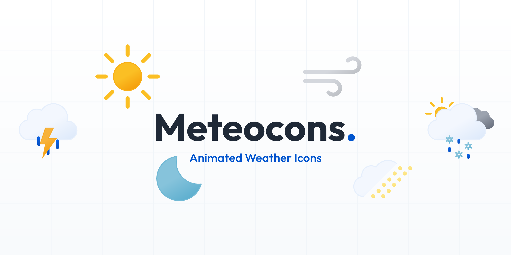

# Meteocons

Animated weather icons for the modern web. 475+ hand-crafted icons in 4 styles, available as SVG and Lottie.

## Packages

| Package                              | Description                    |
|--------------------------------------|--------------------------------|
| [@meteocons/svg](packages/svg)       | Animated SVG weather icons     |
| [@meteocons/lottie](packages/lottie) | Lottie JSON weather animations |

## Installation

```bash
# SVG icons
bun add @meteocons/svg

# Lottie animations
bun add @meteocons/lottie
```

## Styles

Each icon is available in 4 styles:

- **Fill** — Solid filled icons with rich colors
- **Flat** — Flat design without gradients
- **Line** — Clean outline style
- **Monochrome** — Single color icons

## Usage

```html
<!-- SVG -->


<!-- Lottie (with lottie-web) -->
<script>
    import lottie from 'lottie-web';
    import clearDay from '@meteocons/lottie/fill/clear-day.json';

    lottie.loadAnimation({
        container: document.getElementById('icon'),
        animationData: clearDay,
        loop: true,
        autoplay: true,
    });
</script>
```

## CDN

All icons are also available via CDN at `cdn.meteocons.com`:

```
https://cdn.meteocons.com/{version}/svg/{style}/{icon}.svg
https://cdn.meteocons.com/{version}/lottie/{style}/{icon}.json
```

See the [CDN documentation](https://meteocons.com/docs/cdn) for details.

## Development

This is the monorepo for the Meteocons export pipeline, icon packages, documentation and preview website.

### Prerequisites

- [Bun](https://bun.sh) >= 1.0
- A Figma Personal Access Token (see below)

### Setup

```bash
git clone ...
cd meteocons
bun install
cp .env.example .env
# Fill in FIGMA_TOKEN and FIGMA_FILE_KEY
```

### Commands

```bash
bun run fetch              # Fetch SVGs from Figma (uses cache)
bun run fetch --force      # Force re-download
bun run export             # Export all icons (SVG + Lottie)
bun run export --frame X   # Export a single icon
bun run validate           # Validate layer names and coverage
bun run publish-icons      # Copy output to @meteocons/svg and @meteocons/lottie
bun run docs:dev           # Start documentation website
bun run preview:dev        # Start preview website
```

### Figma Personal Access Token

1. Open Figma and click your avatar (top-left)
2. Go to **Settings > Security**
3. Scroll to **Personal access tokens** and click **Generate new token**
4. Select the **`file_content:read`** scope

### Animation configs

Animations are defined as JSON files in `animations/configs/`. Each config specifies which icons (`targets`) to animate and which layers to animate (`layers`). Reusable building blocks live in `animations/partials/` and are merged via `includes`.

### Category configuration

Icon categories are configured in `packages/exporter/categories.json`. The order of categories and icons in this file determines the display order on the website and in the manifest.

## License

[MIT](LICENSE) - Bas Milius

---

<p align="center">
    <a href="https://bas.dev" target="_blank" rel="noopener">
        
    </a>
</p>
